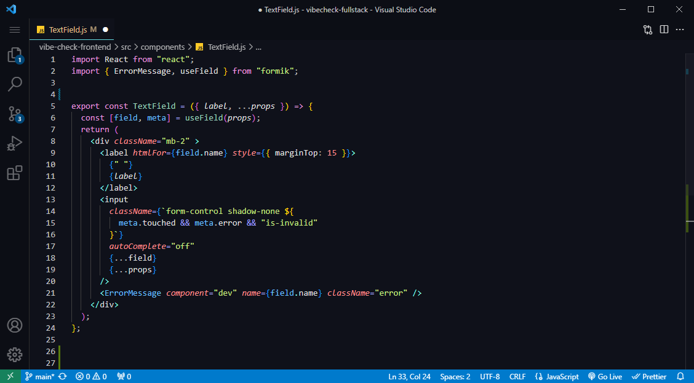
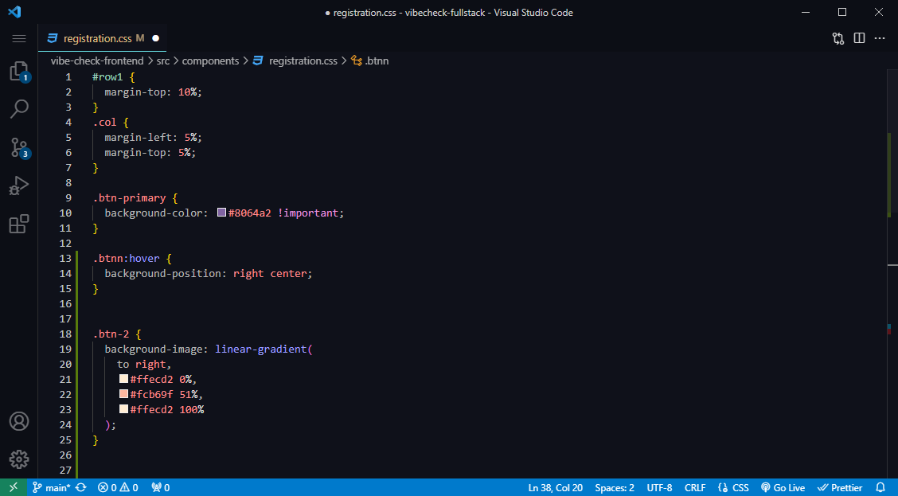
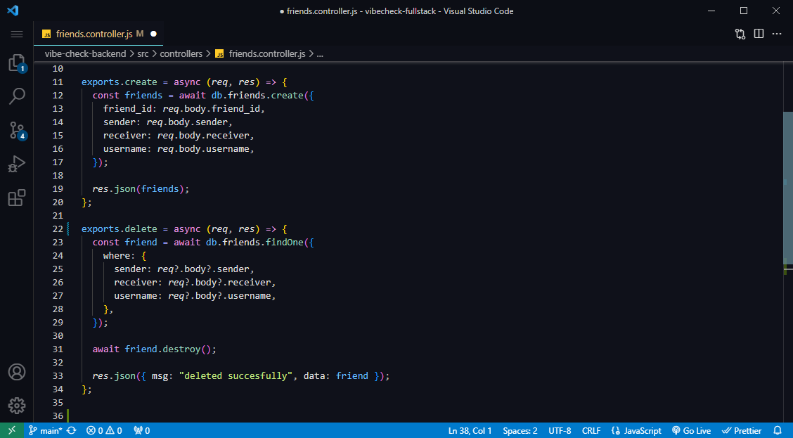
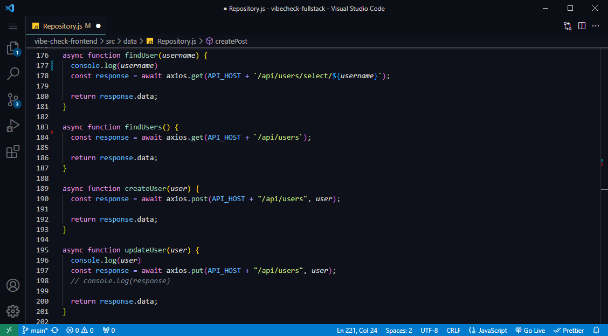

Uranus '84 Theme for VS Code

  
    
   

 
 

## Theme Screenshots

**React.js**

**CSS**

**Node.js**

**JS APIs**

 

## Easy Installation

1. Open the extensions sidebar on Visual Studio Code.
2. Search for **Uranus '84**.
3. Click **Install** to install it.
4. Click **Reload** to reload your editor.
5. Code/File ＞ Preferences ＞ Color Theme ＞ **Uranus '84**.

 

## A Tweak
If you want to play around with new colors, use the setting `workbench.colorCustomizations ` to customize the currently selected theme.

 

## Inspiration
I took inspiration from Material Theme Ocean, and tokyo Night themes.
**Note:** Please note that this is my first time creating a theme, I will be maintaining it as I have time, thanks for your understanding!

 

## Feedback

Please feel free for any suggesstions or issues, use [GitHub issues](https://github.com/HamedKaff/Uranus-84/issues). Please be nice lol, thank you.
